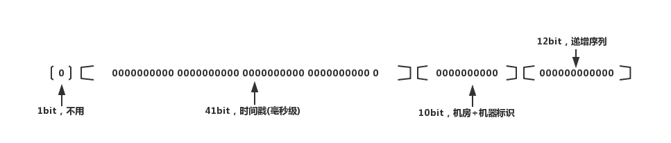

[](https://github.com/rexlin600/basic-leaf.git)

[](https://github.com/rexlin600/basic-leaf/master/LICENSE)


[](https://codecov.io/gh/rexlin600/basic-leaf)

### 分布式全局唯一ID方案

#### 简介

`basic-leaf` 是一个开源的分布式项目，基于Java语言开发。核心实现为Twitter Snowflake算法的分布式ID生成器算法，参考了[robertleepeak](https://github.com/robertleepeak/vesta-id-generator)
的实现。
</br>
</br>
`basic-leaf` 解决的问题是在分布式系统中需要ID全局唯一且具有连续性、能知道某个ID什么时候生成的、其数据中心ID是什么、工作机器ID是什么、以及当前毫秒的序列号。

#### 雪花算法说明

`雪花算法` 是由 `Twitter` 公司开发的一套良好的算法，它是一个带有时间戳的全局唯一ID生成算法，生成该ID具有固定的格式：

> 0   +   41  +   5     +   5    +    12

  - `固定的头部` 0 ，因为二进制第一位是符号位，我们不需要标识符号
  - `41位时间戳`，精确到毫秒级，41位的长度可使用长达69年
  - `5位数据中心ID`，最大值31
  - `5位工作机器ID`，最大值31
  - `12位的计数序列号`，12位支持每毫秒最多生成4096个序列号，足够大多数场景使用了！
  


##### 雪花算法优点

 1. 简单高效，生成速度极快
 2. 不依赖数据库
 3. 时间戳在高位，自增序列在低位，整个ID是按照时间趋势递增的
 4. 灵活度高，可根据业务需求自由划分bit位以满足不同的需求
 
##### 雪花算法缺点

 1. 依赖机器时钟，如果 `时钟回拨` 将可能产生重复ID（解决方案可以参考美团软依赖ZooKeeper来解决）
 2. 分布式环境下，每个服务器时钟不可能完全同步，所以会出现ID不是 `全局递增` 的弊病（解决了上面的缺点，这个缺点也就迎刃而解）
 3. 需要单独 `开发和部署`， 网上大多数教程给的都是 snowflake的核心实现，可以参考本项目，针对上面的弊端做更好的开发和优化
 
##### 核心实现（Java版）

> 下面给出一个实现 `snowflake` 核心算法的参考示例，请记住：snowflake是可以根据自己的业务和需求做相应的调整和优化的，我的意思是
并不是就需要完全按照下面的方式实现其算法核心哈。

 - 核心实现转摘自 简书作者 [Misout](https://www.jianshu.com/p/9d7ebe37215e)，作者文章写得不错，大家可以参考一下。

```java
/**
 * Twitter_Snowflake<br>
 * SnowFlake的结构如下(每部分用-分开):<br>
 * 0 - 0000000000 0000000000 0000000000 0000000000 0 - 00000 - 00000 - 000000000000 <br>
 * 1位标识，由于long基本类型在Java中是带符号的，最高位是符号位，正数是0，负数是1，所以id一般是正数，最高位是0<br>
 * 41位时间截(毫秒级)，注意，41位时间截不是存储当前时间的时间截，而是存储时间截的差值（当前时间截 - 开始时间截)
 * 得到的值），这里的的开始时间截，一般是我们的id生成器开始使用的时间，由我们程序来指定的（如下下面程序IdWorker类的startTime属性）。
 * 41位的时间截，可以使用69年，年T = (1L << 41) / (1000L * 60 * 60 * 24 * 365) = 69<br>
 * 10位的数据机器位，可以部署在1024个节点，包括5位datacenterId和5位workerId<br>
 * 12位序列，毫秒内的计数，12位的计数顺序号支持每个节点每毫秒(同一机器，同一时间截)产生4096个ID序号<br>
 * 加起来刚好64位，为一个Long型。<br>
 * SnowFlake的优点是，整体上按照时间自增排序，并且整个分布式系统内不会产生ID碰撞(由数据中心ID和机器ID作区分)，并且效率较高，
 * 经测试，SnowFlake每秒能够产生26万ID左右。
 */
public class SnowflakeIdWorker {

    // ==============================Fields===========================================
    /** 开始时间截 (2015-01-01) */
    private final long twepoch = 1420041600000L;

    /** 机器id所占的位数 */
    private final long workerIdBits = 5L;

    /** 数据标识id所占的位数 */
    private final long datacenterIdBits = 5L;

    /** 支持的最大机器id，结果是31 (这个移位算法可以很快的计算出几位二进制数所能表示的最大十进制数) */
    private final long maxWorkerId = -1L ^ (-1L << workerIdBits);

    /** 支持的最大数据标识id，结果是31 */
    private final long maxDatacenterId = -1L ^ (-1L << datacenterIdBits);

    /** 序列在id中占的位数 */
    private final long sequenceBits = 12L;

    /** 机器ID向左移12位 */
    private final long workerIdShift = sequenceBits;

    /** 数据标识id向左移17位(12+5) */
    private final long datacenterIdShift = sequenceBits + workerIdBits;

    /** 时间截向左移22位(5+5+12) */
    private final long timestampLeftShift = sequenceBits + workerIdBits + datacenterIdBits;

    /** 生成序列的掩码，这里为4095 (0b111111111111=0xfff=4095) */
    private final long sequenceMask = -1L ^ (-1L << sequenceBits);

    /** 工作机器ID(0~31) */
    private long workerId;

    /** 数据中心ID(0~31) */
    private long datacenterId;

    /** 毫秒内序列(0~4095) */
    private long sequence = 0L;

    /** 上次生成ID的时间截 */
    private long lastTimestamp = -1L;

    //==============================Constructors=====================================
    /**
     * 构造函数
     * @param workerId 工作ID (0~31)
     * @param datacenterId 数据中心ID (0~31)
     */
    public SnowflakeIdWorker(long workerId, long datacenterId) {
        if (workerId > maxWorkerId || workerId < 0) {
            throw new IllegalArgumentException(String.format("worker Id can't be greater than %d or less than 0", maxWorkerId));
        }
        if (datacenterId > maxDatacenterId || datacenterId < 0) {
            throw new IllegalArgumentException(String.format("datacenter Id can't be greater than %d or less than 0", maxDatacenterId));
        }
        this.workerId = workerId;
        this.datacenterId = datacenterId;
    }

    // ==============================Methods==========================================
    /**
     * 获得下一个ID (该方法是线程安全的)
     * @return SnowflakeId
     */
    public synchronized long nextId() {
        long timestamp = timeGen();

        //如果当前时间小于上一次ID生成的时间戳，说明系统时钟回退过这个时候应当抛出异常
        if (timestamp < lastTimestamp) {
            throw new RuntimeException(
                    String.format("Clock moved backwards.  Refusing to generate id for %d milliseconds", lastTimestamp - timestamp));
        }

        //如果是同一时间生成的，则进行毫秒内序列
        if (lastTimestamp == timestamp) {
            sequence = (sequence + 1) & sequenceMask;
            //毫秒内序列溢出
            if (sequence == 0) {
                //阻塞到下一个毫秒,获得新的时间戳
                timestamp = tilNextMillis(lastTimestamp);
            }
        }
        //时间戳改变，毫秒内序列重置
        else {
            sequence = 0L;
        }

        //上次生成ID的时间截
        lastTimestamp = timestamp;

        //移位并通过或运算拼到一起组成64位的ID
        return ((timestamp - twepoch) << timestampLeftShift) //
                | (datacenterId << datacenterIdShift) //
                | (workerId << workerIdShift) //
                | sequence;
    }

    /**
     * 阻塞到下一个毫秒，直到获得新的时间戳
     * @param lastTimestamp 上次生成ID的时间截
     * @return 当前时间戳
     */
    protected long tilNextMillis(long lastTimestamp) {
        long timestamp = timeGen();
        while (timestamp <= lastTimestamp) {
            timestamp = timeGen();
        }
        return timestamp;
    }

    /**
     * 返回以毫秒为单位的当前时间
     * @return 当前时间(毫秒)
     */
    protected long timeGen() {
        return System.currentTimeMillis();
    }

    //==============================Test=============================================
    /** 测试 */
    public static void main(String[] args) {
        SnowflakeIdWorker idWorker = new SnowflakeIdWorker(0, 0);
        for (int i = 0; i < 1000; i++) {
            long id = idWorker.nextId();
            System.out.println(Long.toBinaryString(id));
            System.out.println(id);
        }
    }
}
```
